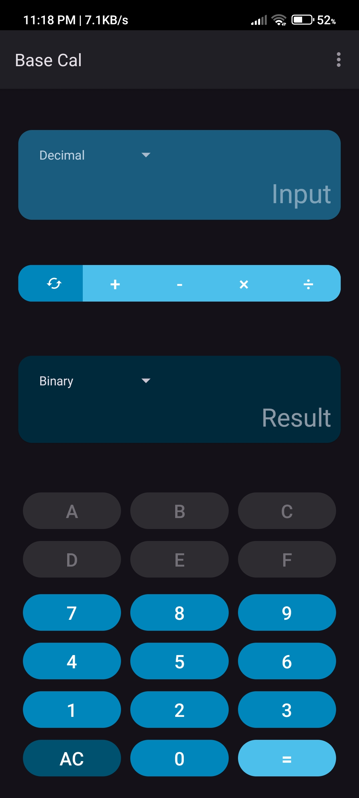
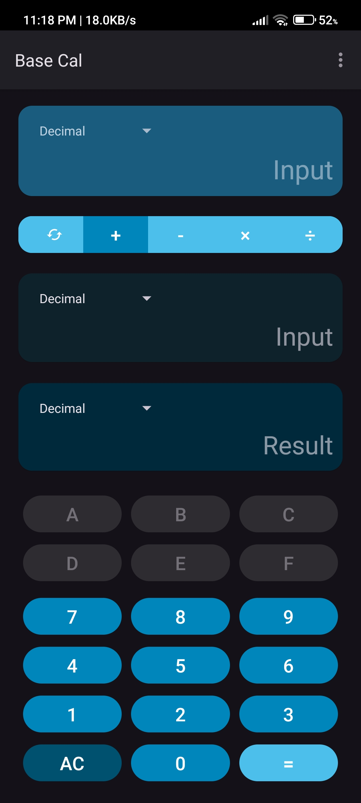
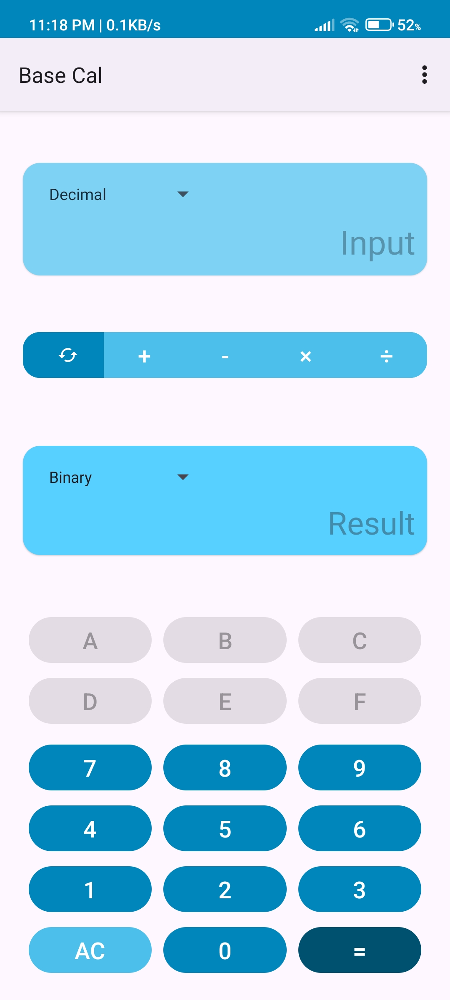
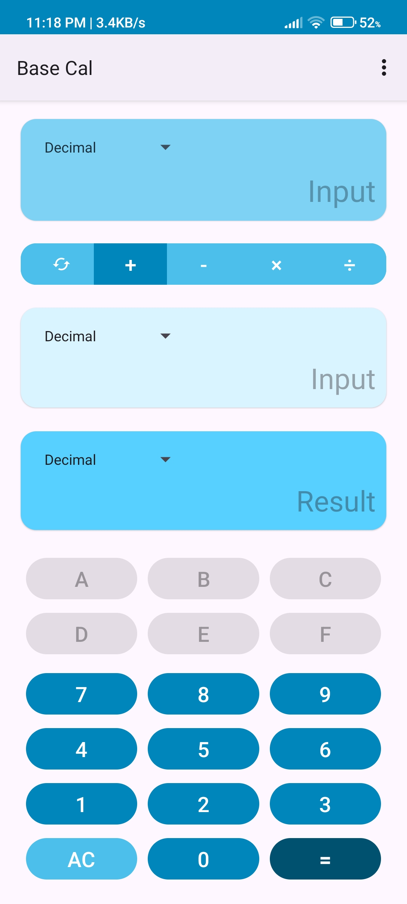

# Base Cal

Base Cal is a powerful, multi-base calculator app for Android that allows seamless calculations and conversions between different number systems including binary, octal, decimal, and hexadecimal.

-orange)

## Features

- **Multi-Base Calculator**: Perform calculations in binary, octal, decimal, and hexadecimal systems
- **Number System Conversion**: Easily convert numbers between different bases
- **Basic Arithmetic Operations**: Addition, subtraction, multiplication, and division across all number systems
- **Material Design**: Clean, modern UI following Material Design 3 guidelines
- **Dark Mode Support**: Fully customizable with light, dark, and system default theme options
- **User-Friendly Interface**: Contextual number input that adapts based on the selected number system

## Screenshots

## Requirements

- Android 8.1 (Oreo) or higher
- Supports both phones and tablets

## Installation

## Usage

### Number Conversion

1. Select the "Convert" option
2. Choose your source number system
3. Enter the number you want to convert
4. Select the destination number system
5. The converted result will be displayed immediately

### Basic Calculations

1. Select the number system for input (binary, octal, decimal, or hexadecimal)
2. Enter your first number using the number pad (note that the available digits will change based on the selected number system)
3. Choose an operation (+, -, ×, ÷)
4. Enter your second number
5. Press "=" to calculate the result
6. The result will be displayed in the selected output base

## Development

### Tech Stack

- Java
- Android SDK
- Material Components for Android
- AndroidX libraries

### Project Structure

- `app/src/main/java/ramith/basecal/` - Java source files
- `app/src/main/res/` - Android resources (layouts, strings, drawables)
- `app/src/main/res/layout/` - UI layout files
- `app/src/main/res/values/` - Configuration values, themes, and styles

## Contributing

Contributions are welcome! If you'd like to contribute:

1. Fork the repository
2. Create a feature branch (`git checkout -b feature/amazing-feature`)
3. Commit your changes (`git commit -m 'Add some amazing feature'`)
4. Push to the branch (`git push origin feature/amazing-feature`)
5. Open a Pull Request

## License

This project is licensed under the MIT License - see the LICENSE file for details.

## Story

This is my first ever Android App built back in March 2022. I developed this app with the basic knowledge of Java I had at that time. So this app didn't had any good coding practices. Later in May 2023, I published it in Google Play Store. But later I lost the source code due to Hard Disk failure. In August 2025, I reverse engineered the APK file I had and extracted Java code and XML files using [JADX](https://github.com/skylot/jadx) and rebuilt the project, then updated the target SDK, fixed the minor issues and updated in Google Play Store. 

## Acknowledgments

- Special thanks to [Tharindu](https://github.com/TYehan), [Kesara](https://github.com/Kesara-Hansajith)
